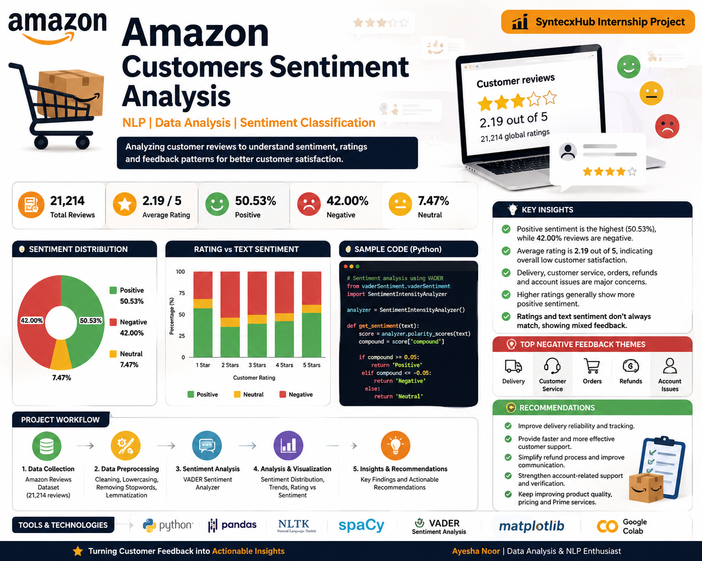

# Amazon Customers Sentiment Analysis

## Project Overview

This project analyzes Amazon customer reviews to understand customer satisfaction, sentiment, ratings, and common patterns in customer feedback.

The project uses Natural Language Processing (NLP) techniques to clean and preprocess review text and perform sentiment classification into Positive, Negative, and Neutral categories.

## Objectives

* Analyze Amazon customer review data
* Clean and preprocess review text
* Analyze customer ratings
* Perform text-based sentiment classification
* Identify patterns in customer feedback
* Visualize sentiment distribution and trends
* Compare customer ratings with text-based sentiment
* Generate insights for improving customer satisfaction

## Dataset

The dataset contains Amazon customer review information, including:

* Reviewer Name
* Country
* Review Count
* Review Date
* Rating
* Review Title
* Review Text
* Date of Experience

The dataset contains approximately 21,214 reviews.

## Technologies and Libraries

* Python
* Pandas
* NumPy
* Matplotlib
* NLTK
* spaCy
* VADER Sentiment Analyzer
* Google Colab

## Data Preprocessing

The review text was processed using several NLP preprocessing techniques:

* Converting text to lowercase
* Removing numbers and unnecessary symbols
* Removing stopwords
* Cleaning unnecessary characters
* Lemmatization

## Sentiment Analysis

VADER Sentiment Analyzer was used to classify review text into three categories:

* **Positive**
* **Negative**
* **Neutral**

### Sentiment Distribution

The text-based sentiment analysis produced the following results:

| Sentiment | Percentage |
| --------- | ---------- |
| Positive  | 50.53%     |
| Negative  | 42.00%     |
| Neutral   | 7.47%      |

## Rating Analysis

The average customer rating in the dataset was approximately **2.19 out of 5**.

The analysis also examined the relationship between customer ratings and text-based sentiment.

Higher ratings generally showed a greater proportion of positive sentiment, while lower ratings contained more negative sentiment.

## Customer Feedback Patterns

Common terms found in negative reviews included:

* Customer
* Service
* Order
* Delivery
* Refund
* Account

These terms indicate that customer service, delivery, refunds, and account-related issues are important areas of customer concern.

Positive reviews commonly included terms such as:

* Good
* Great
* Service
* Order
* Delivery
* Product
* Prime
* Price

These indicate areas that customers frequently appreciate.

## Key Insights

1. Positive reviews represented the largest sentiment category at 50.53%, while 42.00% of reviews were negative.
2. The average rating of approximately 2.19/5 indicates relatively low overall customer satisfaction.
3. Delivery and order-related issues are prominent themes in negative customer feedback.
4. Customer service appears to be another major area of dissatisfaction.
5. Refund and account-related issues also occur frequently in negative reviews.
6. Higher ratings generally correspond to more positive review text.
7. Ratings and text sentiment do not always agree, indicating that some reviews may contain mixed feedback or contextual language.

## Recommendations

* Improve delivery reliability and estimated delivery times.
* Provide faster and more effective customer support.
* Simplify the refund process and provide clearer refund status information.
* Improve account verification and account-related support.
* Continue maintaining areas that receive positive customer feedback, such as products, pricing, delivery, and Prime services.
* Regularly monitor customer reviews to identify recurring issues.

## Project Files

* `Amazon_Sentiment_Analysis.ipynb` — Complete analysis and visualization notebook
* `Amazon_Reviews.csv` — Original dataset
* `Amazon_Reviews_Final.csv` — Processed dataset containing analysis-related columns

## Conclusion

This project demonstrates how NLP and sentiment analysis can be used to analyze customer reviews and identify important patterns in customer satisfaction.

The findings highlight delivery, customer service, refunds, and account-related issues as important areas for improvement, while positive feedback provides useful information about areas that customers value.
